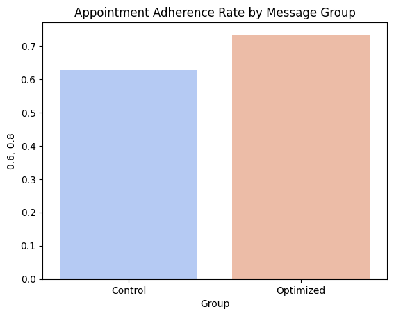

# Healthcare Engagement Experimentation Dashboard

**Role:** Lead Data Scientist (A/B Testing & Modeling)  
**Tools:** Python (Pandas, scikit-learn, statsmodels), SQL, Tableau

## Problem
Operational teams needed to know which messaging timing increased appointment adherence — analogous to a marketing campaign optimization.

## Data
- ~10,000 appointment and outreach records (EMR logs + outreach metadata).  
- Key features: message_time, channel, patient_age_group, prior_no_shows, appointment_type.

## Approach
1. Designed randomized A/B experiments with power calculations.  
2. Cleaned/merged data in SQL; built analysis set in Python.  
3. Modeled treatment effects via logistic regression and uplift modeling; validated with bootstrapped CIs.  
4. Built a Tableau dashboard for leadership: lift, cohort breakdowns, p-values, and roll-out recommendations.

## Results
- **~6%** absolute uplift in appointment adherence (p < 0.05).  
- Identified subgroups with **>10%** incremental lift for prioritized targeting.  
- Projected ~15% reduction in missed appointments at scale; throughput improvement +8%.

## Artifacts
- Notebook: `projects/engagement/notebooks/engagement_ab_analysis.ipynb`  
- Dashboard screenshot: `projects/engagement/dashboard.png`

##Results
- ## Visuals

**Observed Adherence Lift (A/B Test)**  

**Predicted Adherence Probability (Logistic Regression)**  

